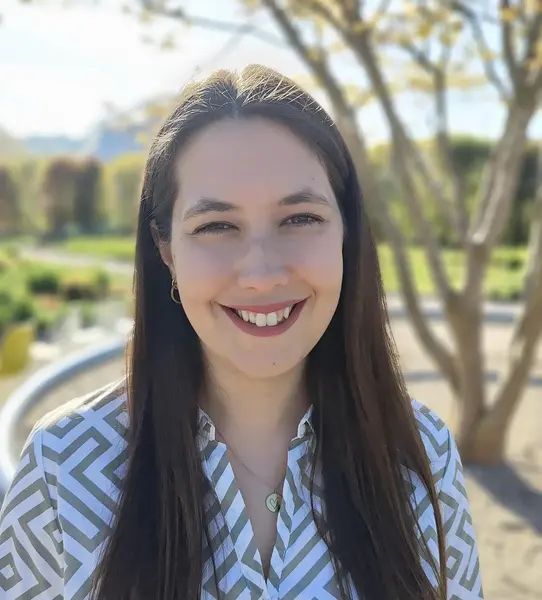



  <h1>Euer Moment - meine Worte</h1>
  
Klar. Tiefgründig. Ergreifend.

    

        <h2>Eure Freie Rednerin für die Region Südschwarzwald, Kaiserstuhl, Hochrhein und die Deutschschweiz oder wo auch immer ihr seid.</h2>
        
In meinen Zeremonien erwarten euch echte Worte mit Tiefgang, die nachhaltig im Herzen wirken.

    

    

        

            
        

    

    

        

            <a href="">
                
                    
                
            </a>
        

        

            <h2>Freie Trauung</h2>
            

                Wünscht ihr euch eine freie Trauung, die eure Liebe authentisch und persönlich feiert? Ich rücke eure Liebe in
                den Fokus und kreiere ein unvergessliches, emotionales Erlebnis, das alle berührt.
            

        

    

    

        

            <a href="">
                
                    
                
            </a>
        

        

            

                <h2>Kinderwillkommensfest</h2>
                 
                

                    Wollt ihr den Beginn eines neuen Lebensabschnitts im Familienkreis feiern? Gemeinsam gestalten wir ein
                    Kinderwillkommensfest, das durch klare, warme Botschaften und authentische Emotionen begeistert.
                

            

        

    

## Unser Weg

    

        

            

                
            

        

        

            <h3>Erstkontakt</h3>
            
Ihr tretet mit mir in Kontakt, ich schicke euch mein Angebot.

        

    

    

        

            

                
            

        

        

            <h3>Unverbindliches Erstgespräch</h3>
            
In diesem Gespräch lernen wir uns kennen, präferiert bei mir Zuhause in Kandern-Wollbach. Falls es die
            Distanz nicht zulässt auch gerne digital.

        

    

    

        

            

                
            

        

        

            <h3>Intensives Zweitgespräch</h3>
            
Vier bis acht Wochen vor eurer Zeremonie stehen eure Liebe und eure Persönlichkeit als Paar / Familie im Fokus. Wir setzen alle
            Puzzelteile zusammen und planen im Detail eure individuelle Zeremonie.

        

    

    

        

            

                
            

        

        

            <h3>Euer Tag</h3>
            
Ihr könnt euch zu 100% auf mich verlassen, ich trage die volle Verantwortung und leite euch sowie eure Gäste
            souverän durch eure Zeremonie.

        

    



Ich freue mich auf eure Anfrage!

Gerne über nachfolgendes Formular oder einfach <a href="https://wa.me/4915679604716" target="_blank">per WhatsApp (+49
156 7960 4716)</a>.



## Kundenstimmen

    

        
<a href="https://maps.app.goo.gl/coULcGCMJ6Mk5TsF9" target="_blank">&quot;Janines Traurede war witzig, kurzweilig und voller Emotionen. Sie ist eine Rednerin, die Ruhe und Souveränität ausstrahlt.&quot; – Anna Gasteier</a>

        
<a href="https://maps.app.goo.gl/mX5aHDeK2XGHdLKs7" target="_blank">&quot;Ich fühlte in jeder Sekunde die Leidenschaft, mit der Janine diesen feierlichen Anlass durchgeführt hat. Ihre Rede hat nicht nur das Brautpaar, sondern auch uns Gäste zutiefst berührt und inspiriert.&quot; – Lisa Doms</a>

        
&quot;Janine überzeugt als Rednerin, die mit Klarheit und tiefem Verständnis Menschen erfasst und sie in ihren Zeremonien in den Mittelpunkt stellt.&quot; - Martin Lieske, Tobias Broek

        
<a href="https://maps.app.goo.gl/kXzSqU54Jot42jWZ7" target="_blank">&quot;Nicht nur wir, sondern auch unsere Gäste waren begeistert von Janines Rede und ihrer Art. Wir empfehlen sie von Herzen weiter [...]&quot; - Gina und Patrick</a>

        
<a href="https://maps.app.goo.gl/cHAnLf78EvfNBPdf8" target="_blank">&quot;Die Trauung hat sowohl uns als auch unseren Gästen außerordentlich gut gefallen. Wir haben uns als Paar jederzeit gut aufgehoben gefühlt.&quot; - Jenny und Jan</a>

        
<a href="https://maps.app.goo.gl/whhRFxvFM8443HHv9" target="_blank">&quot;Ihre Reden sind geprägt von einer Lebendigkeit und Emotionalität, die tief berührt, zum Lachen bringt und Gänsehautmomente schafft.&quot; - Alina Reinhard</a>

        
&quot;Wir können immer noch nicht in Worte fassen, wie schön deine Trauung war. Auch jeder Gast war absolut begeistert. Du hast alle zum weinen, aber auch zum lachen gebracht. Daher noch einmal ein riesen großer Dank an dich!&quot; - Franziska &amp; David

        
&quot;Es fühlte sich an, als würde sie unsere Familie schon seit Jahren kennen. Sie hat unsere Geschichte so persönlich, liebevoll und authentisch erzählt, dass viele emotionale Momente entstanden sind.&quot; - Familie K.

    

